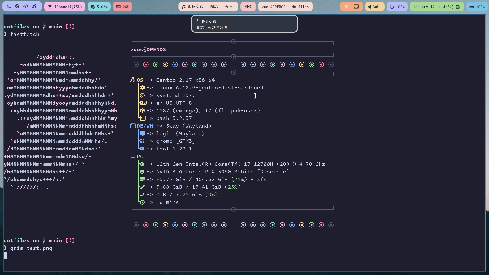

# hyprconfig
some config files about Hyprland, mako and waybar.

## Screenshot

## Some utils

|Program|Describtion|
|:--|:--|
|[waybar](https://github.com/Alexays/Waybar)|Status bars|
|[swaybg](https://github.com/swaywm/swaybg)|Wallpaper|
|[cliphist]([cliphist](https://github.com/sentriz/cliphist))|Clipboard-Managers|
|[grim](https://sr.ht/~emersion/grim/) + [slurp](https://github.com/emersion/slurp)|Screentshot tools|
|[wofi](https://hg.sr.ht/~scoopta/wofi)|App launcher|
|[mako](https://github.com/emersion/mako)|Notification daemon|
|[kitty](https://github.com/kovidgoyal/kitty)|Terminal emulator|
